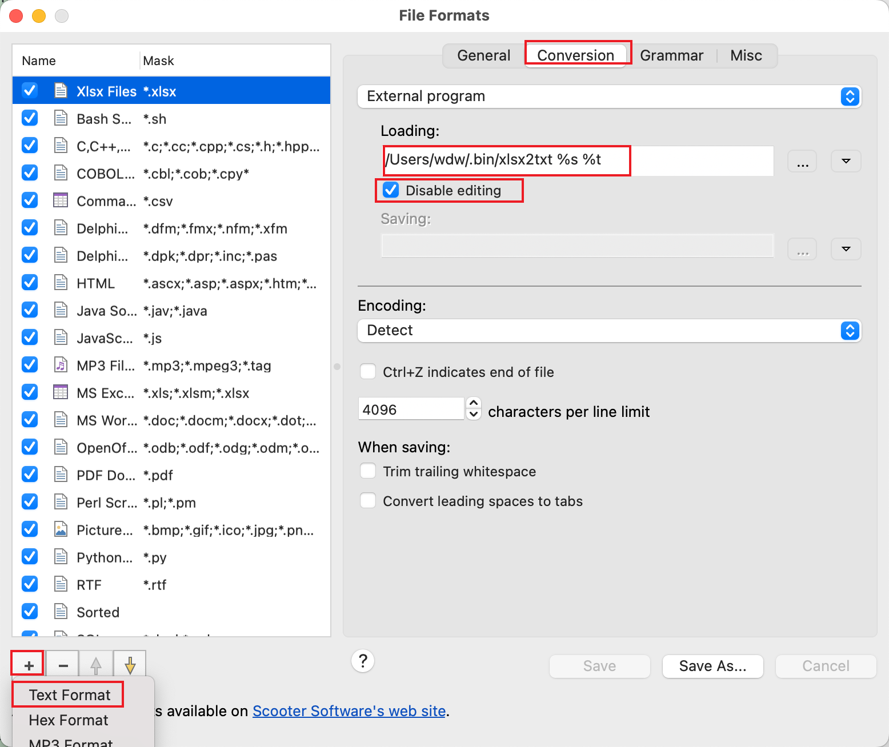
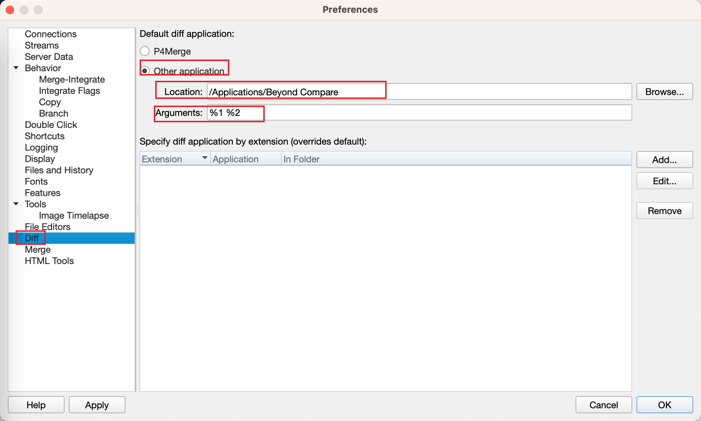

## usage 

    xlsx inputfile outputfile

## beyond compare setting

* open **File Formats** setting dialog
  + mac: beyond compare ---> File Formats
  + win: Tools(工具) ---> File Formats(文件格式)
* new **Text Format(文本格式)**  
  click **+** in the left bottom corner, create new **text format**
* Genernal(常规) tab 
  + Mask(掩码): `*.xlsx`
* Conversion(转换) tab
  + **external program(外部程序ANSI文件名)** to convert excel to txt. download `xlsx2txt` tool from release.
    - windows: `\path\xlsx2txt.exe  "%s" "%t"`
    - other os: `/path/xlsx2txt  "%s" "%t"`
  + check **disable editing**

### variables for external conversion program

* %s - source file and path
* %t - target file and path
* %n - source filename
* %x - extension of the source file

## P4V setting

use beyond compare as the diff tool

+ open setting dialog
  - mac: P4V ---> Preferences
  - win: Edit ---> Preferences
- set diff application in **diff** tab

    
